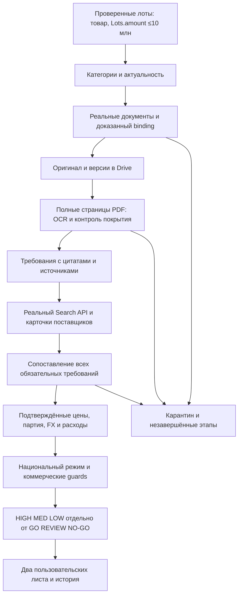

# Исполнимая архитектура: спецификация, не готовые интеграции

Этот PR содержит только документы, каталоги, контракты и тесты спецификации.
Ни новый runtime-код, ни фиктивные PDF/AI/search реализации не добавлены.
Apps Script не публикуется, sync/pilot/trigger не запускаются, Secrets не меняются.
Операционные команды «начинай сразу» из DOCX описывают будущий разрешённый
режим, не расширяют авторизацию текущего задания.

## Исходный документ и полнота

Вложение называется Final_Master_Prompt_Goszakup_AI_Agent.docx; пользователь
обозначил его как Final_Master_Prompt_Goszakup_AI_Agent(3).docx. Сохранены
[точные байты](source.docx), SHA-256 и весь текст [requirements.json](requirements.json).
Извлечены все 260 текстовых XML runs, 258 непустых абзацев основного текста,
50 разделов, вступление и заключительный принцип. Footer содержит только
«Мастер-промпт • » и поле PAGE. Никакие разделы не сокращены в verbatim.
Пользователь указал 13 страниц, DOCX metadata — 1; явных/сохранённых разрывов
страниц нет. Это не доказательство одной страницы: Word пересчитывает вёрстку.
Рендер 13 физических страниц не проверен; полнота проверяется по всему XML-тексту.

[GAP.md](GAP.md) сопоставляет **каждый S01–S50** с текущим модулем,
отсутствующим модулем, критерием и PR. U01–U15 отдельно фиксируют требования
текущего задания, которые дополняют/уточняют DOCX. Полная спецификация
остаётся неизменной даже там, где новая политика строже исходной.

[Каталог](categories.json) сохраняет все 79 оригинальных строк и явные
варианты через «/», включая пересекающиеся HDD/жёсткий диск, картриджи/
картридж, скальные ботинки/туфли. В DOCX нет исчерпывающего словаря
RU/KK/EN-синонимов или списка настоящих партномеров. Пустые массивы —
неизвестность, а не завершённый поиск. Будущее обогащение требует источника,
языка, автора/модели, версии, статуса и проверки. Неоднозначные «Гамма»,
Reach/Reychen, SDR, ушко, царга, зажим, подставка и бренды не назначают
товарную категорию автоматически. Поисковые термины расширяют recall,
но не доказывают товарность и техническое соответствие.

## Совместимость с PR #4

Проверенный main: c31f798; PR #4 открыт, head bdfac5fc574063ee6c1bf8319c6ffe09d4c22d21.
Этот отдельный PR основан на main: изменения PR #4 не копируются второй раз.
Вся таблица GAP отражает main, будущая архитектура использует PR #4 как
**обязательную зависимость сбора**. При объединении конфликтующих runtime
файлов нет: здесь не меняются .gs, манифест, whitelist uploader, workflow,
deploy-settings, существующие тесты и накопленные данные.

PR #4 уже предлагает ограниченные четыре потока дат, Lots.id, fallback
Plans по pointList, карантин, события и счётчик попыток. Эти PILOT_* листы —
экспериментальные наблюдения, не production-каталог и не коммерческие результаты.
Не переводить complete=true в доказательство полного покрытия/готовности.
В дальнейшем production-очередь потребляет проверенные снимки отдельно;
бюджет HTTP учитывает одновременно сбор, документы, OCR и поиск, без
раздельных счётчиков, которые суммарно превышают квоту пользователя.

Сохраняются проверка зоны API, схемы, proof, пагинации и блокировка полного
scan/trigger из PR #4. До его объединения и отдельно разрешённой публикации
нельзя утверждать, что его блокировка уже действует в Google. Даже
mvpReady=true — базовая проверка адаптера, не право запускать всё население
реестра. Активные коды, все способы URL, семантика дат и национальное
покрытие остаются отдельными вопросами. 32,4 млн не обходятся ежедневно.
Пробное git merge-tree без конфликтов и тесты совместного дерева
(150 passed) подтверждены в [CHECKS.md](CHECKS.md); это не merge или publish.

## Поток и границы доверия

Goszakup/производитель/продавец — источники фактов, PDF/HTML — недоверенные
данные. Их инструкции не могут менять секреты, scopes, формулы, источники,
критерии допуска или запускать инструменты. LLM предлагает структурированные
утверждения с цитатами; JavaScript сверяет цитаты/тип/числа и применяет
детерминированные правила. URL разрешаются по политике: HTTPS, allowlist,
проверка редиректов и защиты от SSRF. Bearer Goszakup передаётся только
официальному API origin, не произвольному filePath/магазину/OCR. Чувствительные
query-параметры подписанных URL не записываются в отчёты и публичные ссылки.

## Будущие модули Apps Script

Названия ниже — внутренние проектные модули, не существующие файлы/API поля.
Контракты представлены в [contracts.schema.json](contracts.schema.json),
последовательность внедрения — [IMPLEMENTATION.md](IMPLEMENTATION.md).

| Модуль | Вход → выход | Обязательный guard |
| --- | --- | --- |
| LotDetails / CategoryMatch | Проверенный Lots snapshot → тип/категории/единицы | Plans полностью покрывают pointList; brand-only = REVIEW; amount именно Lots |
| Eligibility | Свежий лот/сроки/способ/правила → OPEN/UPCOMING/CLOSED/UNKNOWN | Подтверждённая зона, реальные права подачи, приглашения и ограничения |
| Documents | Lots.Files/TrdBuy.Files → verified lot-document binding | Нет выдуманного download endpoint; filename/общее объявление не достаточны |
| DocumentStore | bytes + binding → неизменяемая версия Drive | SHA-256 и метаданные; новая версия инвалидирует зависимые результаты |
| PdfText | оригинал → страницы/таблицы/text anchors | Число страниц и статус каждой; скан/чертёж/обрезанный файл не помечается полностью прочитанным |
| TsRequirements | полный PDF + текст → все обязательные требования | Источник/page/quote/offset; отсутствие/конфликт UNKNOWN, не модельная догадка |
| ProductSearch / OfferVerifier | требования → реальные кандидаты/проверенные карточки | Прямой URL, supplier/variant/SKU, состояние, цена, остаток, дата; snippet не цена |
| TechnicalMatch | требования + сведения товара → матрица трёх состояний | Критический MISMATCH исключает; критический UNKNOWN запрещает допуск |
| FxRates / Expenses / TaxBasis | внешние доказательства/профиль → подтверждённые или неизвестные входы | Номинал FX, доставка/НДС/таможня/сертификаты отдельно, нет фиктивного нуля |
| CostModel | подтверждённая партия/расходы → бюджетные/контрактные сценарии | Сопоставимые единицы, доступная партия, decimal-арифметика, отсутствие двойного НДС |
| NationalRegime / Confidence / Decision | доказательства/правила/расчёты → оценка и решение | Национальный режим обязателен; HIGH ≠ GO; неизвестное не допускается автоматически |
| Views / RunReport | канонический анализ → ровно 19/15 колонок и сводка | Пользовательские листы без технических колонок; закрытое выходит из TOP |
| History / Revalidation / Orchestrator | очередь/version/TTL → идемпотентные этапы | Лимиты, lease/lock, история, invalidation, отказ одного лота не останавливает остальные |

## Канонические записи и хранение

Новые технические листы (будущий additive migration): LOT_DETAILS,
DOCUMENTS, REQUIREMENTS, OFFERS, MATCHES, FX_RATES, EXPENSES,
CALCULATIONS, DECISIONS, HISTORY, JOBS, RUN_REPORTS, SOURCE_EVIDENCE.
Существующие ALL_LOTS, NEW_TODAY, ACTIVE_LOTS, SETTINGS, LOGS и PILOT_*
сохраняются. Подтверждённые и неподтверждённые значения цены/наличия/FX/
доставки/расходов — разные записи/поля со статусом и источником, никогда
одна ячейка, которую автоматически принимают за расчётный факт.

Каждый snapshot имеет Lots.id (строка точного целого), отображаемый
lotNumber, trdBuyId/номер, source hash, observedAt и версию. Результат анализа
ключуется `(Lots.id, documentSetHash, requirementsVersion, offersSnapshotHash,
fxSnapshotId, expenseSnapshotId, rulesVersion, taxProfileVersion)`.
История append-only: изменение статуса, документа, цены/наличия, расходов,
уверенности/решения фиксируется отдельно от последнего состояния.

Drive — постоянный оригинальный архив и хранение больших текстов/ответов.
DOCUMENTS содержит Goszakup document ID (включая scope/systemId, если нужно),
lot binding, originalName, source URL без секретов, indexDate как метаданные,
SHA-256 bytes, Drive ID, MIME, размер, историю версии и статус актуальности.
Ключ blob-dedup — byte SHA-256; связь документа с несколькими лотами хранится
отдельно, одинаковые байты не объединяют сами лоты. Устойчивый link указывает
конкретную Drive-версию. Не удалять оригинал при обновлении; дубликат с тем же
hash не загружать. Список актуальных документов/поправок подтверждается
источником; indexDate/порядок/название не являются доказательством версии.

Запрос вложенных Lots.Files обеспечивает исходную связь, но смысл
FileLots.objectId (scalar) и FileTrdBuy.objectId ([Int]) **не считается
доказанным отношением к Lots.id** по одному описанию «ID объекта».
Нужна реальная диагностическая сверка обоих типов и содержимого PDF.
Для общего PDF с несколькими лотами требуется явное выделение нужной секции;
он всё равно хранится и читается полностью. Вложения/поправки ТС входят в
versioned document set. PDF, относящийся к другому лоту/старой версии или
неполученный полностью, не позволяет закрыть quality gate.

OCR хранит raw provider response, число страниц, якоря/table cells и
возможные ошибки. Канонические offsets — UTF-16 для JS, с явной картой
преобразования provider anchors. Цитата должна буквально совпасть с
сохранённым текстом нужной страницы; визуальные сведения/чертежи получают
ссылку на страницу/область и отдельное подтверждение, не выдуманный quote.
Предлагаемые LLM требования сначала UNCONFIRMED. Полный автоматический
список не объявляется без проверки покрытия страниц и второй проверки
обязательности/полноты. На 2–10 первых лотах владелец/эксперт сверяет полный
оригинал с извлечением, включая таблицы, изображения, примечания и сертификаты.

## Техническое соответствие и независимость предложений

Каждое требование хранит значение/единицу/оператор/range, scope товара,
критичность, допускаемый эквивалент, literal quote и evidence ID. Модель,
партномер, материал, размеры, масса, объём/ёмкость, мощность/напряжение,
скорость/производительность, память, интерфейс/форм-фактор, технология,
цвет, комплектность, совместимость, эксплуатация, упаковка, ГОСТ/СТ РК,
сертификаты, гарантия/годность, происхождение, место/срок поставки и
прочие условия из §10 проверяются без автоматического добавления.

Матрица: MATCH / MISMATCH / UNCONFIRMED с отдельным источником товара.
Процент = число подтверждённых существенных обязательных требований /
полное число таких требований ×100; unknown/mismatch не засчитываются,
denominator=0 → null. Критический veto имеет приоритет над процентом.
100% — всё подтверждено; 90–99 — все критические подтверждены и только
второстепенные неопределённости; 70–89 — существенные неизвестности;
<70 — не подходящий. Это явная рабочая методика, которой нет как формулы
в DOCX; её необходимо принять до реализации. Даже 99% не означает GO.

Модель/партномер сверяются буквально с нормализованными разделителями
только если производитель подтверждает их эквивалентность. Аналог разрешён
ТС, не желанием получить маржу. Б/у/refurbished разрешены только явно ТС.
Комплект/вариант/диапазон напряжений/сертификат нельзя подтвердить похожим
названием или заявлением модели. Достаточность количества и сроков оценивается
для всей партии; складских 2 штук недостаточно для заказа 500.

Независимость ≥3 предложений — по реальным юридическим/коммерческим
поставщикам, а не доменам. Один seller на Kaspi/Satu/своём сайте — один
источник. Неустановленная связь не засчитывается как независимость.
Если рынок не даёт три, сохраняются реально найденные предложения и
причина; отсутствие трёх не превращает два в три и не автоматически LOW.
HIGH допускает два независимых подтверждения цены или один надёжный
официальный источник согласно DOCX, но официальный RRP без доступной
конфигурации/покупки/наличия не считается закупочной ценой.

## Расчёты, уверенность и решения

BudgetScenario означает оценку относительно Lots.amount, а не контракт.

- Партия = подтверждённая unit price × сопоставимое количество. Для
  объединённого/многопозиционного лота — сумма подтверждённых строк/комплектов;
  агрегированное Lots.count нельзя умножить на одну произвольную цену.
- BASE_BUDGET profit = budget − goodsCost; margin = profit/budget×100.
- FULL_COST_BUDGET profit = budget − fullCost; margin = profit/budget×100.
- Реальное предложение/контракт — отдельный bidRevenueScenario, только
  если цена выручки явно подтверждена; бюджет не подставляется как факт.
- fullCost = goods + все применимые расходы. UNKNOWN оставляет fullCost,
  окончательную прибыль и margin null. Базовый сценарий может отображаться
  при подтверждённой цене, с явным предупреждением об неизвестных расходах.
- Неизвестный FX → нет подтверждённой KZT цены/маржи. Номинал курса учитывается
  (например, цена за 100 единиц валюты делится на 100), без выдуманного курса.
- НДС gross/net, режим владельца, вычет/невозмещаемые налоги, duty base,
  валюта, комиссии, гарантия/сертификация/упаковка и доставка хранятся раздельно.
  Не считать НДС дважды и не угадывать ставку/льготу/режим.
- Проверки decimal integer/rational масштабов, количества/единиц, округления,
  zero budget (margin null), отрицательной маржи и всей доступной партии.

HIGH/MED/LOW — все условия §26, не оценка «вероятности» от LLM:
HIGH требует оригинальную полную ТС, подтверждённые критические параметры,
≥90%, модель/партномер если требуются, актуальную и достаточно независимо/
официально доказанную цену, наличие, рабочую ссылку, отсутствие критического
несоответствия и понятные существенные расходы. MED требует полную ТС,
критические MATCH, ≥90% и подтверждённую цену, но допускает документированную
неопределённость наличия/доставки/количества/гарантии/сертификации/налогов.
LOW — отсутствие основы/ТС/цены/модели, существенные неизвестности или <90%.

§26 одновременно относит неопределённость наличия к MED и неизвестное
наличие к LOW. Консервативное разрешение: совсем нет доказательства
наличия → LOW; есть датированное подтверждение доступности, но недостаточно
сведений о полной партии/сроке резерва → максимум MED. Это уточнение политики,
не скрытая перепись DOCX; требует принятия владельцем перед реализацией.

GO — только HIGH, все обязательные требования MATCH, свежие binding/версия/
цена/полная партия/сроки/ссылки, подтверждённые расходы/налоговая база/FX,
положительная реалистичная потенциальная прибыль, разрешённая поставка,
подтверждённая допустимость участия и **проверенный национальный режим**.
GO — аналитическая рекомендация, не автоматическая заявка/покупка/контракт.
REVIEW — неизвестный существенный факт, срок, режим, правомочность или
MED/LOW при отсутствии доказанного запрета. Не разрешает поставку автоматически.
NO-GO — доказанное критическое несоответствие, закрытый/недопустимый лот,
запрет режима/участия, невозможная поставка либо неположительная прибыль
по подтверждённому полному сценарию. Низкий риск/confidence не отменяет veto.

Национальный режим проверяется по действующему на дату правилу, предмету/
ЕНС ТРУ, способу, происхождению/производителю/реестру, документам товара и
профилю поставщика. Flags isLightIndustry/disablePersonId и т.п. — сигналы
для проверки, не юридическое решение. Не изобретается registry endpoint
или «универсальное правило допуска». Неизвестно → REVIEW и вне TOP;
NOT_APPLICABLE требует официального основания и источника, не дефолта.
Нужен актуальный официальный источник норм/реестра и ответственный за
правовую сверку; AI не устанавливает применимость без доказательств.

TOP следует всем условиям §36; дополнительные user guards исключают
непроверенный национальный режим, критический UNKNOWN и сомнительный товар.
MED с подтверждённой технической пригодностью/ценой, положительным
**базовым** сценарием и второстепенными коммерческими неизвестностями
может быть показан только как REVIEW (заметка ячейки и легенда), не GO.
Неизвестная цена/валюта/товар или существенная недоказанная пригодность
не дают TOP. Это сохраняет DOCX-условие HIGH или MED, не выдавая REVIEW
за разрешённый коммерческий товар. Если владелец выберет TOP только GO,
это отдельное явно согласованное ужесточение, не незаметное изменение §36.

## Пользовательские листы, повторный запуск и эксплуатация

«Полный список лотов» — ровно 19 колонок §27, «Топ по прибыльности» — ровно
15 §36, точные массивы в contracts.schema.json. Технические ID/решения/даты/
режимы/история отдельно; в пользовательском листе доступны ссылки и заметки
ячеек/легенда с режимом расчёта и REVIEW. Неподтверждённая сумма — пустой
numeric value и отображаемое «Не подтверждено», не 0. Цена заказчика,
полученная budget/count, допускается только как явно помеченный derived
budget unit, при подтверждённых единицах; не притворяется полем API/контракта.

Профессиональный стиль ровно §34–35, сортировка §37. Видео не приложено,
поэтому пиксельное сходство не заявляется. Численные пороги «высокой» и
«умеренной» маржи владелец выбирает; они не влияют на GO. Для записи новые
листы создаются additively; несовместимые существующие заголовки/данные
останавливают миграцию. Сначала backup и preview, пользовательские заметки
и техническая история не стираются. Каноническое Lots.id связывает результат
независимо от физической строки и сортировки; пользовательский номер видим.

Статус, сроки, documents, offers, inventory, FX, расходы и rules version
имеют собственные approved TTL. Старую цену нельзя объявлять свежей;
новая ТС инвалидирует требования, matching и расчёт, изменение FX/цен —
расчёт/decision/TOP. Изменения записываются в HISTORY до promotion нового
snapshot; idempotency keys/flush/retry защищают от дубликатов. Первая версия
для 2–10 лотов сохраняет checkpoint каждого этапа, не выполняет всю цепочку
в одном 6-минутном вызове. Долгие native API operations опрашиваются позднее,
без busy-wait; отдельные job IDs с lease/lock и bounded continuation после
разрешения владельца. Никакие такие триггеры здесь не создаются.

Квоты/стоимость резервируются **до каждой попытки**, включая retries,
в общей книге всех адаптеров; счётчик не равен оставшейся квоте Google.
Исчерпание/неизвестная цена API → остановка этапа, сохранённое состояние,
никакого продвижения watermark/положительного отчёта. Бюджет облачного
billing-alert — уведомление, не аппаратный лимит расхода. Размер файлов/
страниц/LLM tokens/запросов контролируется до отправки; текущие provider
limits подтверждаются при выбранном процессоре/model/region. Большие
ответы и PDF не пишутся в Script Properties (9 KB/value, 500 KB/store);
6 минут исполнения, предел Sheets 10 млн ячеек и URL Fetch учитываются.

Результат запуска — короткая сводка §48 плюс counts UNKNOWN/REVIEW,
фактические расходы/квоты и причины незавершения. Отказ одного лота/сайта
сохраняется как unavailable; обработка других продолжается в пределах
разрешённого бюджета. Интеграция считается выполненной только после
реального чтения/записи, подтверждённого источниками и повторным чтением.
